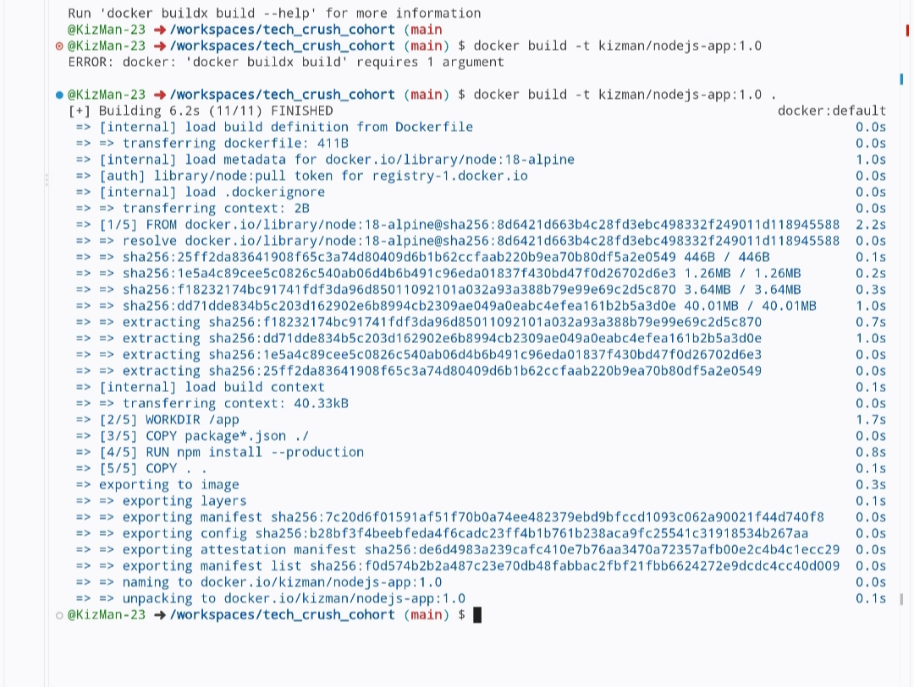
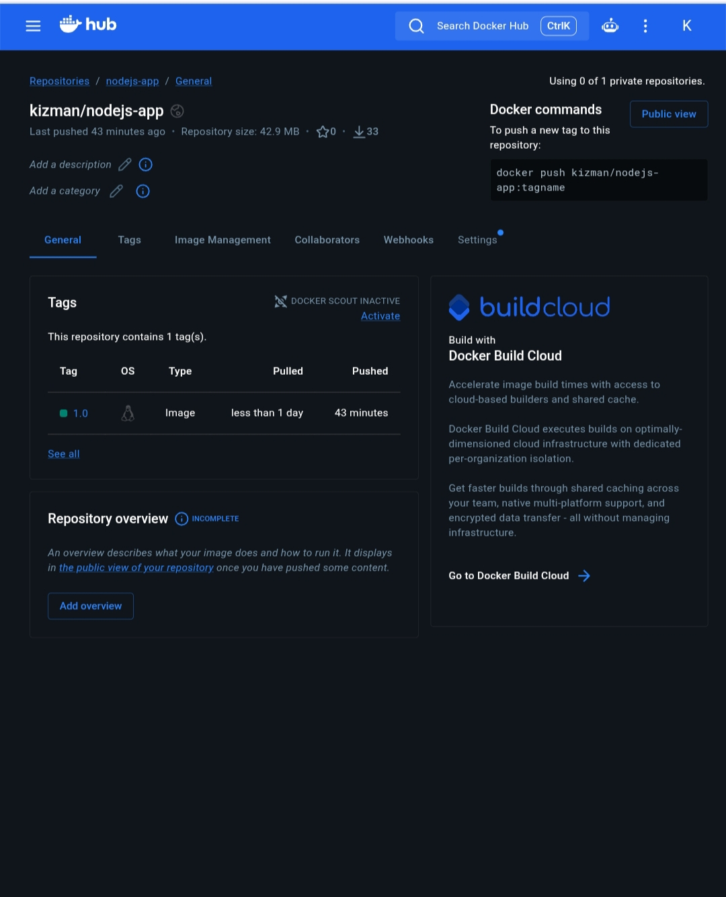
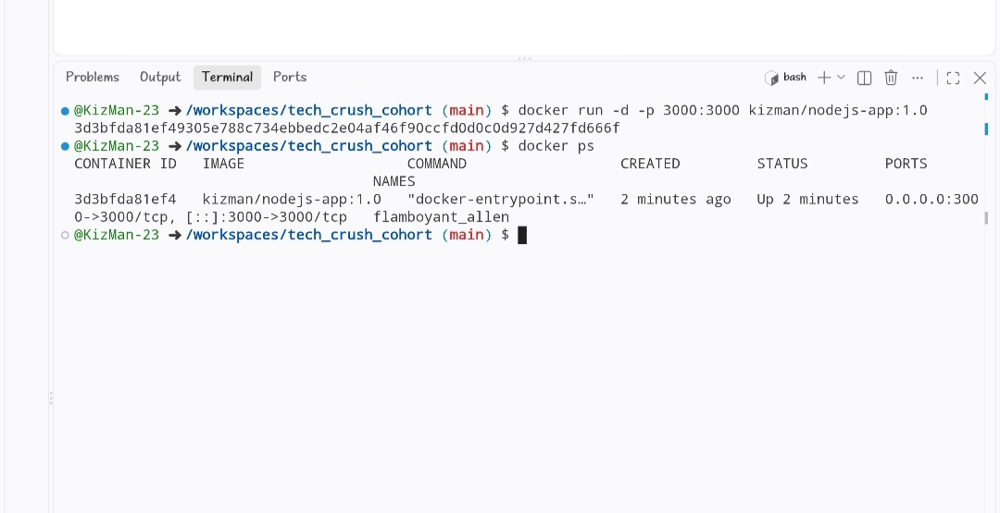
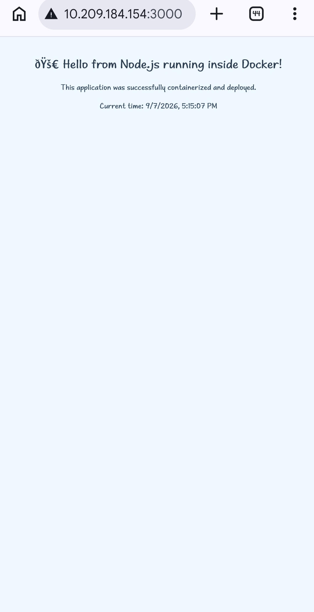

# Node.js & Docker Deployment Assignment

Simple Node.js web application containerized with Docker and pushed to Docker Hub.

## Application Files
- `app.js` – Main application
- `package.json` – Project metadata and scripts
- `uploads` - Media files for README.md
- `Dockerfile` – Instructions to build the Docker image

## How to Run Locally (without Docker)

npm install
npm start

## Docker Build

## Docker Hub Image

## Running Container

## Live Application

